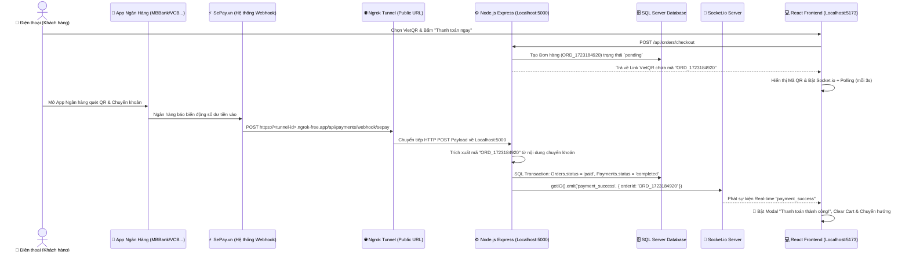

# 🚀 Hướng Dẫn Tích Hợp & Giải Thích Luồng Code Thanh Toán QR Tự Động (Auto Payment Detection)

> **Dự án:** Volitify E-commerce Systems (FPT Project)  
> **Tính năng:** Tự động nhận diện giao dịch chuyển khoản VietQR và cập nhật đơn hàng thành công Real-time.

---

## 📌 1. Tổng Quan & Kiến Trúc Hệ Thống (System Overview)

Hệ thống cho phép khách hàng thanh toán bằng cách quét mã **VietQR** bằng App Ngân hàng bất kỳ (MBBank, Vietcombank, Techcombank, MoMo...). Khi tiền cập bến tài khoản ngân hàng, hệ thống **tự động phát hiện và nhảy màn hình "Thanh toán thành công!"** trên trình duyệt của khách hàng chỉ trong 1-3 giây mà không cần bấm F5 hay bất kỳ phím nào.

### 🔄 Sơ đồ Luồng Hoạt Động (End-to-End Flow Diagram):



---

## 🛠️ 2. Hướng Dẫn Cấu Hình Chạy Thật Trên Localhost (SePay + Ngrok)

Để test bằng **tiền thật trên điện thoại**, bạn thực hiện 3 bước đơn giản (Miễn phí 100%):

### Step 1: Đăng ký SePay.vn (Miễn phí 100 giao dịch/tháng)
1. Đăng ký tài khoản tại: [https://sepay.vn](https://sepay.vn)
2. Kết nối tài khoản Ngân hàng cá nhân của bạn (MBBank, Vietcombank, TPBank, ACB, Techcombank, MoMo...).

### Step 2: Tự Động Khởi Chạy Ngrok Khi Chạy `pnpm run dev`
Bây giờ khi bạn gõ lệnh chạy dự án:
```bash
pnpm run dev
```
Hệ thống sẽ **tự động khởi chạy song song Backend, Frontend và Ngrok Tunnel**!
Ngay trên cửa sổ Terminal sẽ in ra thông báo màu nổi bật chứa Webhook URL:
```text
==================================================
🚀 [NGROK TUNNEL CREATED SUCCESSFULLY]
🌐 Public URL:  https://a1b2-34-56-78.ngrok-free.app
⚡ Webhook URL: https://a1b2-34-56-78.ngrok-free.app/api/payments/webhook/sepay
📌 Copy Webhook URL ở trên và dán vào SePay.vn!
==================================================
```

### Step 3: Dán Webhook URL vào SePay
1. Đăng nhập SePay ➔ Chọn menu **Cấu hình Webhook** ➔ Thêm mới Webhook.
2. Dán đường dẫn: `https://a1b2-34-56-78.ngrok-free.app/api/payments/webhook/sepay`
3. Phương thức: `POST` | Kiểu dữ liệu: `JSON`.

---

## 🧠 3. Giải Thích Chi Tiết Luồng Code (Code Flow Deep-Dive)

### 3.1 Tầng Backend Core

#### A. File `backend/src/config/socket.js`
* Lưu giữ biến `ioInstance` từ `setupSocket(server)`.
* Export hàm `getIO()` để mọi Controller có thể dễ dàng gọi và phát thông báo Real-time đến các client đang kết nối.

```javascript
let ioInstance = null;
export const getIO = () => ioInstance;

export const setupSocket = (server) => {
  const io = new Server(server, { /* cors config */ });
  ioInstance = io;
  // ...
};
```

#### B. File `backend/src/controllers/payment.controller.js`

1. **Hàm `markOrderPaid(orderId, transactionRef)`:**
   * Khởi tạo `sql.Transaction(pool)` để đảm bảo tính toàn vẹn dữ liệu.
   * Cập nhật `Orders.status = 'paid'`.
   * Cập nhật `Payments.status = 'completed'`, lưu mã giao dịch `transactionRef`.
   * **Phát tín hiệu Socket.io:** `getIO().emit('payment_success', { orderId, amount, status: 'paid' })`.

2. **Hàm `handleSepayWebhook(req, res)`:**
   * Đón HTTP POST Webhook từ SePay gửi tới.
   * Trích xuất thông tin chuỗi `content` và `description` bằng Regular Expression:
     ```javascript
     const match = textToSearch.match(/(ORD_[A-Za-z0-9_-]+|[0-9a-f]{8}-[0-9a-f]{4}-[0-9a-f]{4}-[0-9a-f]{4}-[0-9a-f]{12})/i);
     ```
   * Tìm thấy mã `ORD_...` -> Tự động gọi `markOrderPaid(matchedOrderId, ...)` và phản hồi status 200 cho SePay.

3. **Hàm `simulatePaymentSuccess(req, res)`:**
   * Phục vụ chế độ Demo/Testing cực kỳ tiện lợi dưới máy Localhost khi không muốn bật Ngrok. Gọi trực tiếp `markOrderPaid(orderId, 'SIMULATED_DEMO')`.

4. **Hàm `checkPaymentStatusPublic(req, res)`:**
   * Cung cấp API Public cho Frontend gọi Polling kiểm tra trạng thái thanh toán của đơn hàng theo chu kỳ 3 giây (cơ chế phòng vệ đệm khi kết nối mạng rớt).

---

### 3.2 Tầng Frontend Real-time UI

#### A. File `frontend/src/services/paymentService.ts`
Khai báo 2 API phương thức mới:
* `checkPaymentStatusPublic(orderId)`: Kiểm tra xem đơn hàng đã được trả tiền chưa.
* `simulatePaymentSuccess(orderId)`: Gửi yêu cầu giả lập thanh toán thành công cho Demo.

#### B. File `frontend/src/pages/Checkout.tsx`

1. **Hiệu ứng Tự động Nhận diện (Auto-Detection Effect):**
   * Sử dụng `useEffect` kích hoạt khi `createdOrderId` xuất hiện và phương thức là `qr`.
   * **Kênh 1 (Socket.io Real-time):** Lắng nghe sự kiện `socketService.on('payment_success')`. Ngay khi Backend phát tín hiệu, lập tức gọi `handlePaymentSuccessConfirmed()`.
   * **Kênh 2 (Polling Backup):** Chạy `setInterval` mỗi 3 giây gọi `checkPaymentStatusPublic(createdOrderId)`. Nếu phát hiện `isPaid = true`, lập tức xóa interval và kích hoạt màn hình chúc mừng.

```typescript
useEffect(() => {
  if (!createdOrderId || method !== 'qr' || showSuccessModal) return;

  // 1. Socket.io Listener
  const unbindSocket = socketService.on('payment_success', (data: any) => {
    if (!data?.orderId || data?.orderId === createdOrderId) {
      handlePaymentSuccessConfirmed();
    }
  });

  // 2. Polling Backup (mỗi 3s)
  const pollInterval = setInterval(async () => {
    const res = await paymentService.checkPaymentStatusPublic(createdOrderId);
    if (res?.isPaid) {
      clearInterval(pollInterval);
      handlePaymentPaymentConfirmed();
    }
  }, 3000);

  return () => { unbindSocket(); clearInterval(pollInterval); };
}, [createdOrderId, method, showSuccessModal]);
```

2. **Giao diện Mã VietQR Động & Nút Giả Lập Demo:**
   * Hiển thị chỉ báo nhấp nháy xanh: `🟢 Đang tự động nhận diện giao dịch chuyển khoản...`
   * Hiển thị mã đơn hàng dạng mono highlighted để khách copy chuyển khoản.
   * Trang bị nút **`🧪 [DEMO] Giả lập Khách quét QR thanh toán thành công`** để thầy cô/bạn bè bấm thử trực tiếp khi demo trên máy local!

---

## 🧪 4. Hướng Dẫn Chạy Demo Thực Tế

### 🎬 Kịch bản Demo 1: Giả lập Nhanh (Dành cho Báo cáo Thuyết trình)
1. Trên web `http://localhost:5173`, chọn 1 sản phẩm ➔ Thêm vào giỏ ➔ Bấm **Thanh toán ngay**.
2. Tại màn hình Checkout, chọn **Chuyển khoản VietQR** ➔ Bấm **Thanh toán qua VietQR**.
3. Màn hình hiện mã VietQR kèm chỉ báo nhấp nháy xanh.
4. Bấm vào nút màu cam **`🧪 [DEMO] Giả lập Khách quét QR thanh toán thành công`**.
5. **KẾT QUẢ:** Màn hình lập tức nhảy Modal chúc mừng **"🎉 Đặt hàng thành công!"**, giỏ hàng tự động làm rỗng và lưu đơn vào SQL Server!

---

### 🎬 Kịch bản Demo 2: Chuyển khoản Tiền Thật bằng Điện thoại
1. Bật lệnh `npx ngrok http 5000` và dán Webhook vào SePay.vn.
2. Đặt đơn hàng mới trên web ➔ Mã VietQR xuất hiện.
3. Lấy điện thoại thật ➔ Mở App MBBank / Vietcombank / MoMo ➔ Quét mã QR trên màn hình máy tính ➔ Bấm **Chuyển khoản** (Ví dụ 1.000đ).
4. **KẾT QUẢ:** Trong vòng 1-3 giây sau khi ngân hàng trừ tiền, màn hình máy tính **TỰ ĐỘNG** nhảy màu xanh báo thanh toán thành công mà **không cần bấm bất kỳ phím nào**!
