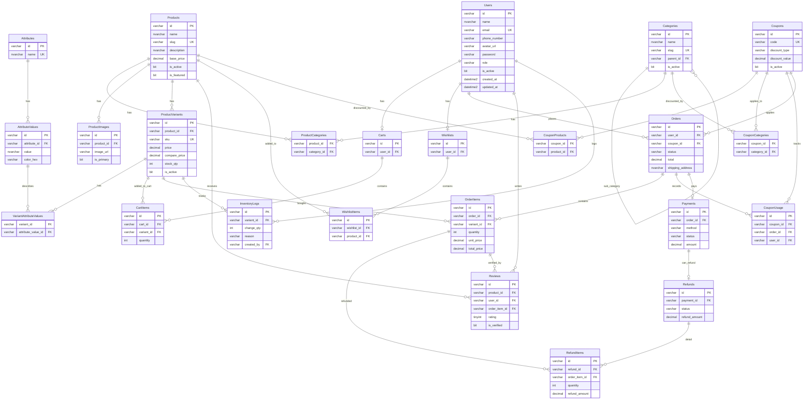

# 🗄️ Hướng Dẫn Cấu Hình Kết Nối Database SQL Server (MS SQL)

Tài liệu này hướng dẫn chi tiết từng bước cách thiết lập và cấu hình cơ sở dữ liệu **Microsoft SQL Server** để kết nối hoàn hảo với Backend của dự án **E-Com FPT**.

---

## 📌 1. Yêu Cầu Chuẩn Bị Ban Đầu (Prerequisites)

Đảm bảo máy tính của bạn đã được cài đặt sẵn 2 công cụ chính thức từ Microsoft:
1. **Microsoft SQL Server 2022 (Bản Express hoặc Developer):** [Tải bộ cài đặt tại đây](https://www.microsoft.com/en-us/sql-server/sql-server-downloads) *(Khuyên dùng bản Developer đầy đủ tính năng)*.
2. **SQL Server Management Studio (SSMS):** [Tải SSMS tại đây](https://learn.microsoft.com/en-us/sql/ssms/download-sql-server-management-studio-ssms) *(Phần mềm giao diện quản trị cơ sở dữ liệu)*.

---

## 🔑 2. Kích Hoạt Chế Độ Đăng Nhập Hỗn Hợp (Mixed Mode) & Tài Khoản `sa`

Mặc định khi cài đặt, SQL Server sẽ khóa tài khoản `sa` và chỉ cho phép đăng nhập bằng tài khoản Windows. Bạn cần kích hoạt theo các bước sau:

1. Mở **SSMS** ➡️ Đăng nhập bằng chế độ mặc định **Windows Authentication**.
2. Nhấn nút **New Query** ở thanh công cụ phía trên.
3. Sao chép và dán toàn bộ đoạn mã dưới đây vào cửa sổ Query rồi nhấn **Execute (F5)**:

```sql
-- 1. Kích hoạt tài khoản sa
ALTER LOGIN sa ENABLE;
GO

-- 2. Đặt mật khẩu mới cho sa và mở khóa tài khoản
-- Bạn có thể đổi 'MatKhauCuaSa123' thành mật khẩu bạn tự chọn
ALTER LOGIN sa WITH PASSWORD = 'MatKhauCuaSa123' UNLOCK;
GO

-- 3. Ép cấu hình hệ thống chuyển sang chế độ đăng nhập hỗn hợp (Mixed Mode)
USE [master]
GO
EXEC xp_instance_regwrite N'HKEY_LOCAL_MACHINE', N'Software\Microsoft\MSSQLServer\MSSQLServer', N'LoginMode', REG_DWORD, 2
GO
```

4. Đảm bảo ở khung bên dưới thông báo: **`Commands completed successfully.`**

---

## ⚡ 3. Cấu Hình Mạng & Dịch Vụ Hệ Thống (TCP/IP & SQL Browser)

Để Node.js kết nối được vào SQL Server phiên bản Express (`SQLEXPRESS`), bạn bắt buộc phải bật giao thức mạng **TCP/IP** và dịch vụ **SQL Server Browser**.

### 🛠️ Cách nhanh nhất bằng PowerShell (Chắc chắn thành công):
1. Bấm phím **Windows**, gõ tìm kiếm chữ **`PowerShell`**.
2. Click chuột phải vào **Windows PowerShell** ➡️ chọn **`Run as Administrator`** (Chạy dưới quyền Quản trị viên).
3. Copy toàn bộ đoạn lệnh dưới đây dán vào PowerShell và nhấn **Enter**:

```powershell
# 1. Bật giao thức mạng TCP/IP cho SQL Server 2022 Express
Set-ItemProperty -Path 'HKLM:\SOFTWARE\Microsoft\Microsoft SQL Server\MSSQL16.SQLEXPRESS\MSSQLServer\SuperSocketNetLib\Tcp' -Name 'Enabled' -Value 1 -ErrorAction SilentlyContinue

# 2. Bật giao thức mạng Named Pipes
Set-ItemProperty -Path 'HKLM:\SOFTWARE\Microsoft\Microsoft SQL Server\MSSQL16.SQLEXPRESS\MSSQLServer\SuperSocketNetLib\Np' -Name 'Enabled' -Value 1 -ErrorAction SilentlyContinue

# 3. Kích hoạt và Tự động chạy dịch vụ SQL Server Browser (Dò tìm cổng động)
Set-Service -Name 'SQLBrowser' -StartupType Automatic; Start-Service -Name 'SQLBrowser'

# 4. Khởi động lại dịch vụ SQL Server ngầm để áp dụng cấu hình
Restart-Service -Name 'MSSQL$SQLEXPRESS' -Force
```

---

## ⚙️ 4. Cấu Hình Dự Án Backend

Bạn mở file cấu hình môi trường **`backend/.env`** của dự án E-Com FPT lên và cập nhật chính xác các thông số cơ sở dữ liệu của bạn:

```env
# SQL Server Database Configuration
DB_USER=sa
DB_PASSWORD=MatKhauCuaSa123   # <--- Đổi thành mật khẩu của tài khoản sa bạn đặt ở Bước 2
DB_SERVER=localhost
DB_DATABASE=ecomfpt
DB_INSTANCE=SQLEXPRESS
```

---

## 🚀 5. Cơ Chế Tự Động Khởi Tạo Tiện Lợi (Auto-Initialization)

Dự án **E-Com FPT** đã được tích hợp bộ điều phối tự động cực kỳ thông minh tại file `backend/src/config/db.js`. Khi bạn chạy lệnh khởi động Backend (`pnpm dev`):

1. **Auto Create Database:** Hệ thống tự kết nối SQL Server, kiểm tra và tự tạo database **`ecomfpt`** nếu chưa có.
2. **Auto Create Tables:** Tự động tạo đầy đủ **24 bảng** (xem sơ đồ ERD bên dưới) theo đúng thứ tự phụ thuộc khóa ngoại.
3. **Auto Seeding Data:** Nếu phát hiện bảng trống (và `NODE_ENV !== 'production'`), hệ thống sẽ seed sẵn dữ liệu mẫu:
   - **2 tài khoản thử nghiệm:** `admin@ecom.com` & `customer@ecom.com` (mật khẩu mặc định: `password123`, cấu hình qua biến `SEED_PASSWORD`)
   - **8 Categories:** Điện Tử, Âm Thanh, Máy Tính, Phụ Kiện, Wearables, Gia Dụng, Nhà Bếp, Thời Trang (có hỗ trợ danh mục cha/con)
   - **3 Attributes** với **12 AttributeValues:** Màu sắc (5 màu), Dung lượng (3 options), Kích thước (S/M/L/XL)
   - **6 Products** tiếng Việt với **10 ProductVariants** (ảnh thật từ Unsplash, giá VNĐ)

> Chi tiết đầy đủ về seed data xem tại [PROJECT_CONTEXT.md](../PROJECT_CONTEXT.md).

---

## 📊 6. Sơ Đồ Thực Tế Hệ Thống Cơ Sở Dữ Liệu (Database ERD — 24 bảng)

Schema được định nghĩa trong [`backend/src/config/initDb.js`](../backend/src/config/initDb.js) (source of truth) và [`backend/src/config/schema.sql`](../backend/src/config/schema.sql) (bản copy để chạy SSMS).

### 🎨 Sơ đồ trực quan Mermaid (Xem trực tiếp trong Markdown / GitHub)


        string id PK
        string name
        string email UK
        string phoneNumber
        string password
        string role
        datetime createdAt
    }
    Addresses {
        string id PK
        string userId FK
        string receiverName
        string phoneNumber
        string addressLine1
        string addressLine2
        string city
        string state
        string country
        boolean isDefault
    }
    Categories {
        string id PK
        string name
        string slug
        string parentId FK
    }
    Products {
        string id PK
        string categoryId FK
        string name
        string description
        decimal price
        string image
    }
    ProductImages {
        string id PK
        string productId FK
        string imageUrl
        boolean isPrimary
    }
    ProductVariants {
        string id PK
        string productId FK
        string sku
        decimal price
        int stock
        string size
        string color
    }
    Carts {
        string id PK
        string userId FK
    }
    CartItems {
        string id PK
        string cartId FK
        string productId FK
        string variantId FK
        int quantity
    }
    Coupons {
        string id PK
        string code UK
        string discountType
        decimal discountValue
        boolean active
    }
    Orders {
        string id PK
        string userId FK
        string couponId FK
        decimal totalPrice
        string status
        string shippingAddressId FK
    }
    OrderItems {
        string id PK
        string orderId FK
        string productId FK
        string variantId FK
        int quantity
        decimal price
    }
    Payments {
        string id PK
        string orderId FK
        string paymentMethod
        decimal amount
        string status
    }
    Reviews {
        string id PK
        string userId FK
        string productId FK
        int rating
        string comment
    }

    Users ||--o{ Addresses : "has"
    Users ||--o| Carts : "has"
    Users ||--o{ Orders : "places"
    Users ||--o{ Reviews : "writes"
    
    Carts ||--o{ CartItems : "contains"
    Products ||--o{ CartItems : "added"
    ProductVariants ||--o{ CartItems : "variant"
    
    Categories ||--o{ Products : "classifies"
    Categories ||--o{ Categories : "sub-category"
    Products ||--o{ ProductImages : "has"
    Products ||--o{ ProductVariants : "has"
    Products ||--o{ Reviews : "receives"
    
    Orders ||--o{ OrderItems : "contains"
    Products ||--o{ OrderItems : "bought"
    ProductVariants ||--o{ OrderItems : "variant-bought"
    
    Orders ||--o{ Payments : "pays"
    Coupons ||--o{ Orders : "applies"
```

### 📊 Mã nguồn DBML (Dán vào [dbdiagram.io](https://dbdiagram.io/) để kéo thả)

```dbml
// E-Com FPT — Full Schema DBML (paste at https://dbdiagram.io/)
// SOURCE: backend/src/config/initDb.js

Table Users {
  id varchar [pk]
  name nvarchar
  email varchar [unique]
  phone_number varchar
  avatar_url varchar
  password varchar
  role varchar
  is_active boolean
  created_at datetime
  updated_at datetime
}

Table Categories {
  id varchar [pk]
  name nvarchar
  slug varchar [unique]
  description nvarchar
  image_url varchar
  parent_id varchar [ref: > Categories.id]
  sort_order int
  is_active boolean
  created_at datetime
}

Table Products {
  id varchar [pk]
  name nvarchar
  slug varchar [unique]
  description nvarchar
  short_desc nvarchar
  base_price decimal
  is_active boolean
  is_featured boolean
  created_at datetime
  updated_at datetime
}

Table ProductImages {
  id varchar [pk]
  product_id varchar [ref: > Products.id]
  image_url varchar
  alt_text nvarchar
  sort_order int
  is_primary boolean
  created_at datetime
}

Table ProductCategories {
  product_id varchar [ref: > Products.id]
  category_id varchar [ref: > Categories.id]
}

Table Attributes {
  id varchar [pk]
  name nvarchar [unique]
  created_at datetime
}

Table AttributeValues {
  id varchar [pk]
  attribute_id varchar [ref: > Attributes.id]
  value nvarchar
  color_hex varchar
  sort_order int
}

Table ProductVariants {
  id varchar [pk]
  product_id varchar [ref: > Products.id]
  sku varchar [unique]
  price decimal
  compare_price decimal
  stock_qty int
  weight_kg decimal
  image_url varchar
  is_active boolean
  created_at datetime
  updated_at datetime
}

Table VariantAttributeValues {
  variant_id varchar [ref: > ProductVariants.id]
  attribute_value_id varchar [ref: > AttributeValues.id]
}

Table InventoryLogs {
  id varchar [pk]
  variant_id varchar [ref: > ProductVariants.id]
  change_qty int
  reason nvarchar
  reference_id varchar
  created_by varchar [ref: > Users.id]
  created_at datetime
}

Table Reviews {
  id varchar [pk]
  product_id varchar [ref: > Products.id]
  user_id varchar [ref: > Users.id]
  order_item_id varchar [ref: > OrderItems.id]
  rating tinyint
  title nvarchar
  body nvarchar
  is_verified boolean
  is_approved boolean
  created_at datetime
  updated_at datetime
}

Table Carts {
  id varchar [pk]
  user_id varchar [ref: - Users.id]
  created_at datetime
  updated_at datetime
}

Table CartItems {
  id varchar [pk]
  cart_id varchar [ref: > Carts.id]
  variant_id varchar [ref: > ProductVariants.id]
  quantity int
  added_at datetime
}

Table Wishlists {
  id varchar [pk]
  user_id varchar [ref: - Users.id]
  created_at datetime
}

Table WishlistItems {
  id varchar [pk]
  wishlist_id varchar [ref: > Wishlists.id]
  product_id varchar [ref: > Products.id]
  added_at datetime
}

Table Coupons {
  id varchar [pk]
  code varchar [unique]
  description nvarchar
  discount_type varchar
  discount_value decimal
  min_order_amount decimal
  max_discount_amt decimal
  usage_limit int
  used_count int
  user_limit int
  starts_at datetime
  expires_at datetime
  is_active boolean
  created_at datetime
}

Table CouponProducts {
  coupon_id varchar [ref: > Coupons.id]
  product_id varchar [ref: > Products.id]
}

Table CouponCategories {
  coupon_id varchar [ref: > Coupons.id]
  category_id varchar [ref: > Categories.id]
}

Table Orders {
  id varchar [pk]
  user_id varchar [ref: > Users.id]
  coupon_id varchar [ref: > Coupons.id]
  status varchar
  subtotal decimal
  discount_amount decimal
  shipping_fee decimal
  total decimal
  shipping_name nvarchar
  shipping_phone varchar
  shipping_address nvarchar
  shipping_city nvarchar
  shipping_country nvarchar
  note nvarchar
  created_at datetime
  updated_at datetime
}

Table OrderItems {
  id varchar [pk]
  order_id varchar [ref: > Orders.id]
  variant_id varchar [ref: > ProductVariants.id]
  quantity int
  unit_price decimal
  total_price decimal
  product_name nvarchar
  variant_info nvarchar
  created_at datetime
}

Table Payments {
  id varchar [pk]
  order_id varchar [ref: - Orders.id]
  method varchar
  status varchar
  amount decimal
  transaction_ref varchar
  paid_at datetime
  created_at datetime
}

Table Refunds {
  id varchar [pk]
  payment_id varchar [ref: - Payments.id]
  reason nvarchar
  status varchar
  refund_amount decimal
  refunded_at datetime
  created_at datetime
}

Table RefundItems {
  id varchar [pk]
  refund_id varchar [ref: > Refunds.id]
  order_item_id varchar [ref: > OrderItems.id]
  quantity int
  refund_amount decimal
}

Table CouponUsage {
  id varchar [pk]
  coupon_id varchar [ref: > Coupons.id]
  order_id varchar [ref: > Orders.id]
  user_id varchar [ref: > Users.id]
  used_at datetime
}
```

