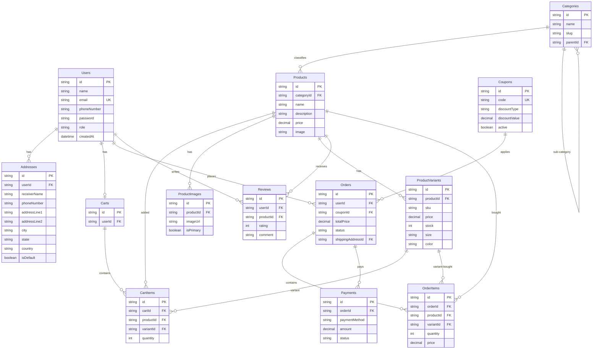

# 🗄️ Hướng Dẫn Cấu Hình Kết Nối Database SQL Server (MS SQL)

Tài liệu này hướng dẫn chi tiết từng bước cách thiết lập và cấu hình cơ sở dữ liệu **Microsoft SQL Server** để kết nối hoàn hảo với Backend của dự án **E-Com FPT**.

---

## 📌 1. Yêu Cầu Chuẩn Bị Ban Đầu (Prerequisites)

Đảm bảo máy tính của bạn đã được cài đặt sẵn 2 công cụ chính thức từ Microsoft:
1. **Microsoft SQL Server 2022 (Bản Express hoặc Developer):** [Tải bộ cài đặt tại đây](https://www.microsoft.com/en-us/sql-server/sql-server-downloads) *(Khuyên dùng bản Developer đầy đủ tính năng)*.
2. **SQL Server Management Studio (SSMS):** [Tải SSMS tại đây](https://learn.microsoft.com/en-us/sql/ssms/download-sql-server-management-studio-ssms) *(Phần mềm giao diện quản trị cơ sở dữ liệu)*.

---

## 🔑 2. Kích Hoạt Chế Độ Đăng Nhập Hỗn Hợp (Mixed Mode) & Tài Khoản `sa`

Mặc định khi cài đặt, SQL Server sẽ khóa tài khoản `sa` và chỉ cho phép đăng nhập bằng tài khoản Windows. Bạn cần kích hoạt theo các bước sau:

1. Mở **SSMS** ➡️ Đăng nhập bằng chế độ mặc định **Windows Authentication**.
2. Nhấn nút **New Query** ở thanh công cụ phía trên.
3. Sao chép và dán toàn bộ đoạn mã dưới đây vào cửa sổ Query rồi nhấn **Execute (F5)**:

```sql
-- 1. Kích hoạt tài khoản sa
ALTER LOGIN sa ENABLE;
GO

-- 2. Đặt mật khẩu mới cho sa và mở khóa tài khoản
-- Bạn có thể đổi 'MatKhauCuaSa123' thành mật khẩu bạn tự chọn
ALTER LOGIN sa WITH PASSWORD = 'MatKhauCuaSa123' UNLOCK;
GO

-- 3. Ép cấu hình hệ thống chuyển sang chế độ đăng nhập hỗn hợp (Mixed Mode)
USE [master]
GO
EXEC xp_instance_regwrite N'HKEY_LOCAL_MACHINE', N'Software\Microsoft\MSSQLServer\MSSQLServer', N'LoginMode', REG_DWORD, 2
GO
```

4. Đảm bảo ở khung bên dưới thông báo: **`Commands completed successfully.`**

---

## ⚡ 3. Cấu Hình Mạng & Dịch Vụ Hệ Thống (TCP/IP & SQL Browser)

Để Node.js kết nối được vào SQL Server phiên bản Express (`SQLEXPRESS`), bạn bắt buộc phải bật giao thức mạng **TCP/IP** và dịch vụ **SQL Server Browser**.

### 🛠️ Cách nhanh nhất bằng PowerShell (Chắc chắn thành công):
1. Bấm phím **Windows**, gõ tìm kiếm chữ **`PowerShell`**.
2. Click chuột phải vào **Windows PowerShell** ➡️ chọn **`Run as Administrator`** (Chạy dưới quyền Quản trị viên).
3. Copy toàn bộ đoạn lệnh dưới đây dán vào PowerShell và nhấn **Enter**:

```powershell
# 1. Bật giao thức mạng TCP/IP cho SQL Server 2022 Express
Set-ItemProperty -Path 'HKLM:\SOFTWARE\Microsoft\Microsoft SQL Server\MSSQL16.SQLEXPRESS\MSSQLServer\SuperSocketNetLib\Tcp' -Name 'Enabled' -Value 1 -ErrorAction SilentlyContinue

# 2. Bật giao thức mạng Named Pipes
Set-ItemProperty -Path 'HKLM:\SOFTWARE\Microsoft\Microsoft SQL Server\MSSQL16.SQLEXPRESS\MSSQLServer\SuperSocketNetLib\Np' -Name 'Enabled' -Value 1 -ErrorAction SilentlyContinue

# 3. Kích hoạt và Tự động chạy dịch vụ SQL Server Browser (Dò tìm cổng động)
Set-Service -Name 'SQLBrowser' -StartupType Automatic; Start-Service -Name 'SQLBrowser'

# 4. Khởi động lại dịch vụ SQL Server ngầm để áp dụng cấu hình
Restart-Service -Name 'MSSQL$SQLEXPRESS' -Force
```

---

## ⚙️ 4. Cấu Hình Dự Án Backend

Bạn mở file cấu hình môi trường **`backend/.env`** của dự án E-Com FPT lên và cập nhật chính xác các thông số cơ sở dữ liệu của bạn:

```env
# SQL Server Database Configuration
DB_USER=sa
DB_PASSWORD=MatKhauCuaSa123   # <--- Đổi thành mật khẩu của tài khoản sa bạn đặt ở Bước 2
DB_SERVER=localhost
DB_DATABASE=ecomfpt
DB_INSTANCE=SQLEXPRESS
```

---

## 🚀 5. Cơ Chế Tự Động Khởi Tạo Tiện Lợi (Auto-Initialization)

Dự án **E-Com FPT** đã được tích hợp bộ điều phối tự động cực kỳ thông minh tại file `backend/src/config/db.js`. Khi bạn chạy lệnh khởi động Backend (`pnpm dev`):

1. **Auto Create Database:** Hệ thống sẽ tự động kết nối vào SQL Server và kiểm tra xem có database tên là **`ecomfpt`** chưa. Nếu chưa có, nó sẽ tự động tạo cơ sở dữ liệu mới tinh.
2. **Auto Create Tables:** Tự động tạo bảng **`Users`** và bảng **`Products`** với đầy đủ các ràng buộc, khóa chính và kiểu dữ liệu chuẩn xác.
3. **Auto Seeding Data:** Tự động nạp sẵn **2 tài khoản thử nghiệm** (`admin@ecom.com` & `customer@ecom.com` với mật khẩu chung là `password123`) cùng **6 sản phẩm công nghệ cao cấp mẫu** vào database nếu phát hiện bảng trống.

> **Bạn chỉ cần cấu hình xong và khởi động dự án, toàn bộ thế giới dữ liệu sẽ tự động được thiết lập sẵn sàng để bạn trải nghiệm và lập trình!**

---

## 📊 6. Sơ Đồ Thực Tế Hệ Thống Cơ Sở Dữ Liệu (Database ERD & Specifications)

Dưới đây là sơ đồ thiết kế cơ sở dữ liệu hoàn chỉnh, chuyên nghiệp và đã được tối ưu hóa cho dự án E-Commerce (đã bao gồm các trường **`phoneNumber`** tại tài khoản `Users` và địa chỉ giao hàng `Addresses`).

### 🎨 Sơ đồ trực quan Mermaid (Xem trực tiếp trong Markdown / GitHub)



### 📊 Mã nguồn DBML (Dán vào [dbdiagram.io](https://dbdiagram.io/) để kéo thả)

```dbml
Table Users {
  id varchar [pk]
  name nvarchar
  email varchar [unique]
  phoneNumber varchar
  password varchar
  role varchar
  createdAt datetime
}

Table Addresses {
  id varchar [pk]
  userId varchar [ref: > Users.id]
  receiverName nvarchar
  phoneNumber varchar
  addressLine1 nvarchar
  addressLine2 nvarchar
  city nvarchar
  state nvarchar
  country nvarchar
  isDefault boolean
}

Table Categories {
  id varchar [pk]
  name nvarchar
  slug varchar
  parentId varchar [ref: > Categories.id]
}

Table Products {
  id varchar [pk]
  categoryId varchar [ref: > Categories.id]
  name nvarchar
  description nvarchar
  price decimal
  image varchar
  createdAt datetime
}

Table ProductImages {
  id varchar [pk]
  productId varchar [ref: > Products.id]
  imageUrl varchar
  isPrimary boolean
}

Table ProductVariants {
  id varchar [pk]
  productId varchar [ref: > Products.id]
  sku varchar
  price decimal
  stock int
  size varchar
  color varchar
}

Table Carts {
  id varchar [pk]
  userId varchar [ref: - Users.id]
  createdAt datetime
}

Table CartItems {
  id varchar [pk]
  cartId varchar [ref: > Carts.id]
  productId varchar [ref: > Products.id]
  variantId varchar [ref: > ProductVariants.id]
  quantity int
  addedAt datetime
}

Table Coupons {
  id varchar [pk]
  code varchar [unique]
  discountType varchar
  discountValue decimal
  minOrderValue decimal
  expiryDate datetime
  active boolean
}

Table Orders {
  id varchar [pk]
  userId varchar [ref: > Users.id]
  couponId varchar [ref: > Coupons.id]
  totalPrice decimal
  status varchar
  shippingAddressId varchar [ref: > Addresses.id]
  createdAt datetime
}

Table OrderItems {
  id varchar [pk]
  orderId varchar [ref: > Orders.id]
  productId varchar [ref: > Products.id]
  variantId varchar [ref: > ProductVariants.id]
  quantity int
  price decimal
}

Table Payments {
  id varchar [pk]
  orderId varchar [ref: > Orders.id]
  paymentMethod varchar
  transactionId varchar
  amount decimal
  status varchar
  createdAt datetime
}

Table Reviews {
  id varchar [pk]
  userId varchar [ref: > Users.id]
  productId varchar [ref: > Products.id]
  rating int
  comment nvarchar
  createdAt datetime
}
```

